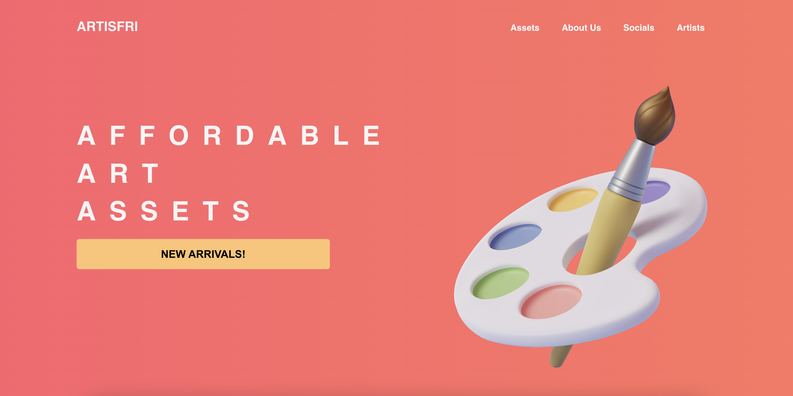
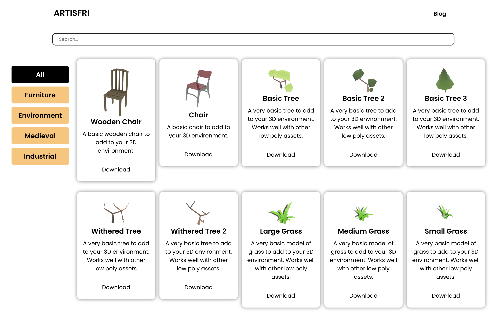

Artisfri is a platform for creators of all sorts to visit and purchase very affordable 3D models.

**A large number of the features are yet to be implemented and will be released in the future. The project is still new and will grow functionally and aesthetically with time.**

We have a team of verified artists working on each of the models, this ensures consistency of the quality and style of the models produced by each artist. We will also be able to provide better customer support as the customer will be able to contact us directly and not have to reach out to a third-party seller.

Whenever our artists release a new batch of models, they will be displayed in our "New Arrivals" section and also be added to our database of all models.

